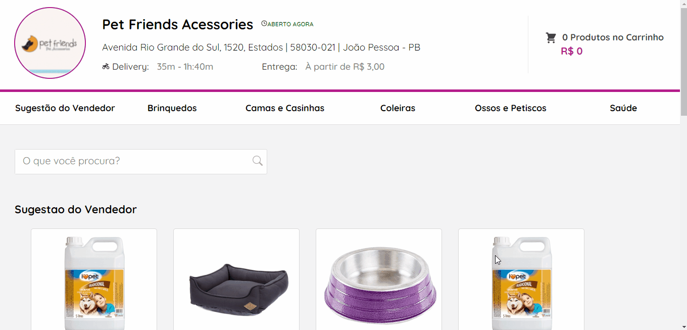

# PetFriends

## 💻 Sobre o projeto  / About The Project
PetFriends é uma lojinha virtual onde o usuario pode selecionar quanto e quais objetos deseja compra e visualizar seu carrinho no header.

PetFriends is an online shop where the user can select how much and which items he/she wants to buy and view his/her cart in the header.

[Feito baseado no "Softcom Challenge - Front-end com React" ](https://github.com/softcomtecnologia/challenge/tree/master/front-end)

## Features

- [x] Procurar Produtos Por Categoria
- [x] Procurar Produtos através da SearchBar,atualizando a lista de procura a cada caractere digitado
- [x] Adicionar Produtos no Carrinho através de um Modal

EN
- [x] Search Products by Category
- [x] Search Products by SearchBar, updating the search list with each character typed
- [x] Add Products to Cart through a Modal

## 🎨 Layout

O layout da aplicação está disponível no Figma:

The layout of the application is available in Figma:

https://www.figma.com/file/6Y64kMphXj7ZnPmmVGch7d/Desafio-UX-(Copy)?node-id=58%3A2096

layout disponibilizado pela SoftCom.

## 🚀 Como executar o projeto (dev) / How to run the project

Este projeto é divido em duas partes:
1. Fake Api (json-server)  
    yarn server
2. Frontend  
    yarn dev

## 🛠 Tecnologias

As seguintes ferramentas foram usadas na construção do projeto:

The following tools were used in the construction of the project:

#### **Website**  ([React](https://reactjs.org/)  +  [TypeScript](https://www.typescriptlang.org/))

-   **[NextJS](https://nextjs.org/)**
-   **[React Icons](https://react-icons.github.io/react-icons/)**
-   **[Axios](https://github.com/axios/axios)**
-   **[Sass](https://sass-lang.com/)**
-   **[JSON Server](https://github.com/typicode/json-server)**
-   **[React-Modal](https://www.npmjs.com/package/react-modal)**

<h1 align="center">
  Adicionando Produtos no Carrinho
  
  Adding Products to the Cart
  
</h1>

<h1 align="center">
  Pesquisando por categoria ou Procurando por nome
  Searching by category or Searching by name
  
</h1>

### Autor
---

 
  
 <b>Flavio Segundo</b></a> <a href="https://github.com/Fpos0">🚀

Feito por Flavio Segundo 👋🏽 Entre em contato!

 
| 

## License
[MIT](https://choosealicense.com/licenses/mit/)
